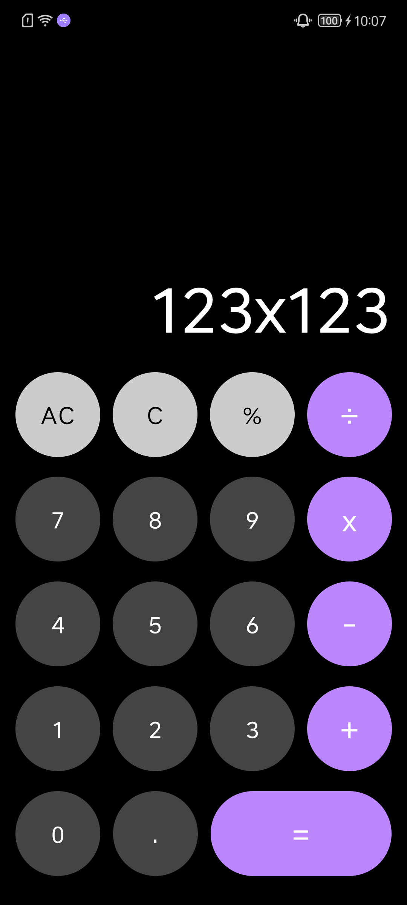

## Compose Calculator

一个使用 Compose 构建的 Calculator (计算器)

### 我的新书

大家可以购买我的新书[《Jetpack Compose：Android全新UI编程》](https://juejin.cn/post/7027020266312056840)进行阅读，里面有完整的
Compose 框架供大家学习。

[京东购买地址](https://item.jd.com/10039809078875.html)

[当当购买地址](http://product.dangdang.com/593507948.html)

呸呸呸，太不要脸了，又在推荐自己的新书。。。

如果对你有帮助的话，别忘记点个 Star，感激不尽。

### 公众号

如果想关注我的话可以关注我的公众号：《江江安卓》，里面会不定期更新有关安卓的知识及个人见解。

### 要求

写这个小项目是因为 Google 的一个活动，看见了就想着参与下，下面是这次活动的要求：

1. 应用界面需全部基于 Jetpack Compose 构建
2. 计算器至少具备最基本的加减乘除四则运算功能
3. 支持横竖屏两种显示模式有额外加分
4. 具有独特的设计创意，或具有更多拓展功能有额外加分

前三点此项目已经实现，第四点的话。。。目前来说此项目中并没有什么独特的设计创意，有可能之后会添加上，更多扩展功能的话。。。公司项目还有一堆等着我呢，简单实现下得了，哈哈哈

### 项目截图



### 实现过程

整个项目其实非常简单，绘制完页面基本就完成了80%，剩下的就是处理下运算结果，没有什么特别说明的，如果想看具体实现的话直接 pull 代码看吧。

### 使用到的库

[hilt](https://developer.android.google.cn/jetpack/androidx/releases/hilt)

[rhino]

### License

```xml
Copyright (c) 2022 朱江

    Permission is hereby granted, free of charge, to any person obtaining a copyof this software and associated documentation files (the "Software"), to dealin the Software without restriction, including without limitation the rightsto use, copy, modify, merge, publish, distribute, sublicense, and/or sellcopies of the Software, and to permit persons to whom the Software isfurnished to do so, subject to the following conditions:

    The above copyright notice and this permission notice shall be included in allcopies or substantial portions of the Software.
```